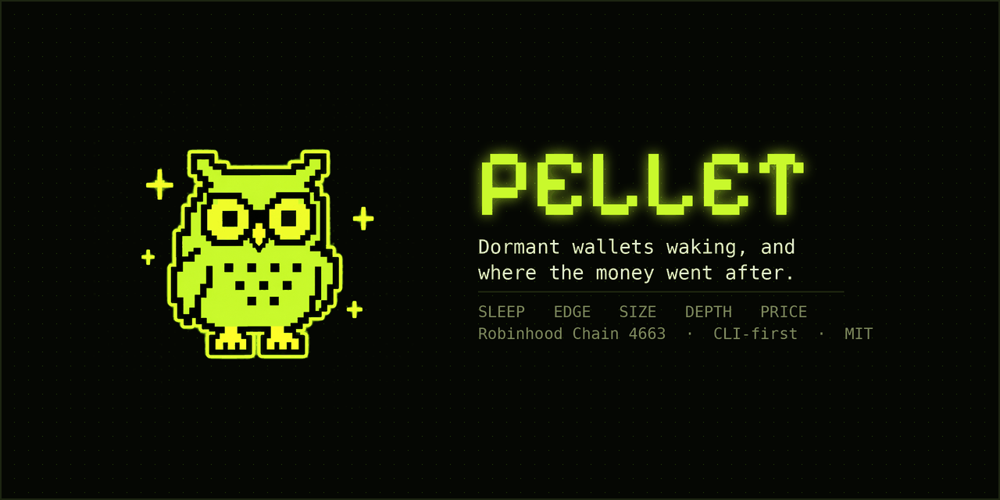
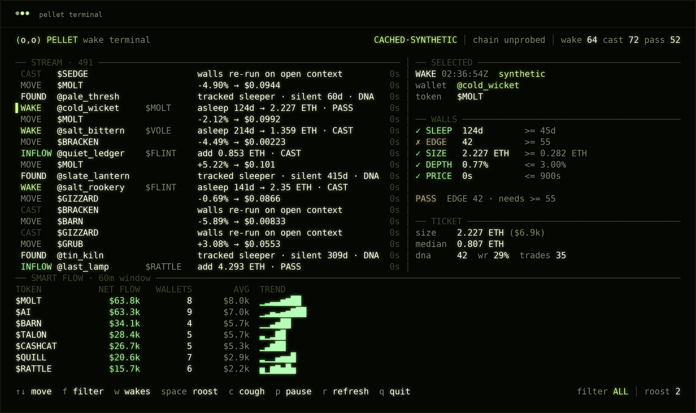
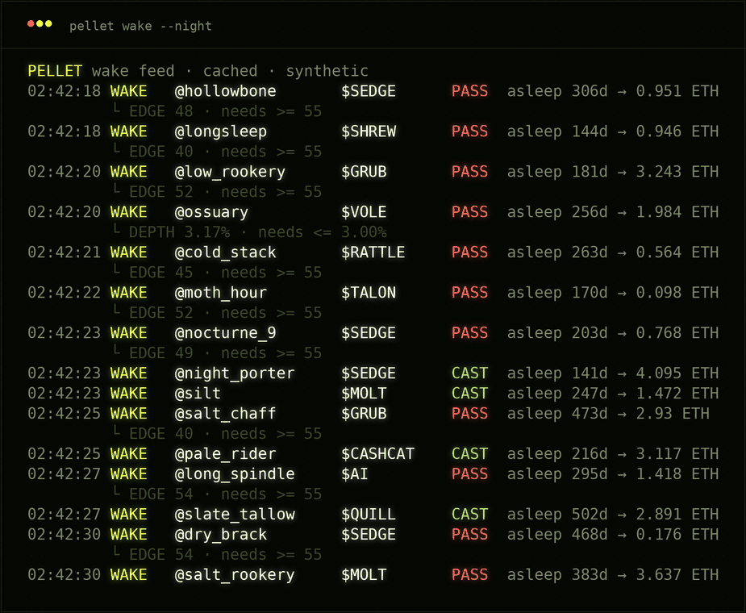
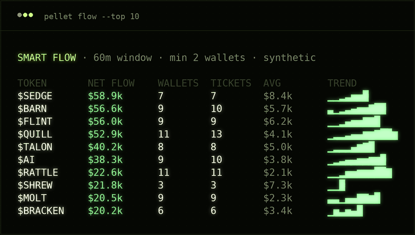
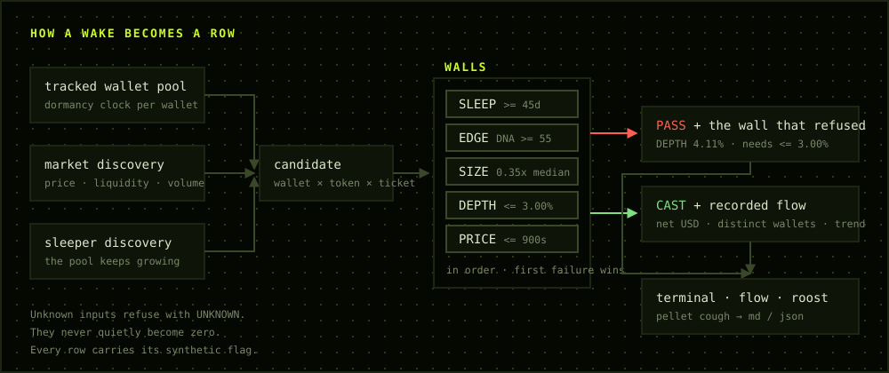
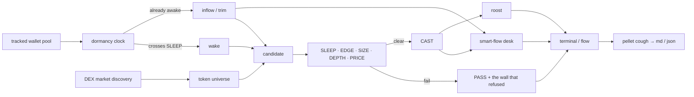

<p align="center">
  
</p>

[](assets/banner.png)

# PELLET

**A wake terminal for Robinhood Chain.**
It watches whale wallets that went silent, catches the moment they move again,
and tracks where the money goes next.

`sleepers → wake → five walls → smart-flow desk → roost → readable pellet`


[Install](#install) · [Terminal](#terminal) · [Walls](#the-walls) · [Flow desk](#flow-desk) · [Pellet](#the-pellet) · [Site](#the-site) · [Commands](#commands)

---

## About

**PELLET is a working local-first wake terminal for Robinhood Chain.**

An active wallet trades constantly, so any single entry says almost nothing. A
wallet that has been silent for a year and then signs something has made a
decision rather than followed a habit. PELLET watches for exactly that, pushes
every wake through a five-wall decision box, prints the wall that refused it, and
keeps a rolling desk of where tracked money actually went in the same window.

The CLI is the product. The browser layer is an optional read-only mirror of the
same runtime.

### Current build

| Engine | Status | What is already in the repo |
| --- | --- | --- |
| Wake detection | **WORKING** | per-wallet dormancy, threshold crossing, wake events |
| Sleeper discovery | **WORKING** | the tracked pool grows during the session instead of draining |
| PELLET walls | **WORKING** | `SLEEP / EDGE / SIZE / DEPTH / PRICE` with the refusal named |
| Smart-flow desk | **WORKING** | net flow, distinct-wallet floor, trims subtract, sparklines |
| Pellet export | **WORKING** | full wallet record to Markdown or JSON |
| Roost | **WORKING** | local watchlist, atomic writes |
| Terminal UI | **WORKING** | two panes, live desk, keyboard control, clean restore |
| Website | **WORKING** | landing, docs and a typeable web terminal on the same wall logic |

[](assets/terminal.png)

> `npm start` opens the terminal. `npm run wake` is the raw scrolling feed.
> `npm run flow` prints the desk and exits.

---

## Why it is called a pellet


An owl swallows its prey whole and coughs up a pellet: a dry, readable record of
everything it ate, bones included. Nothing is digested away.

That is the shape of the product. The terminal swallows the whole stream — wakes,
inflows, trims, refusals — and `pellet cough <handle>` brings one wallet back up
in a form you can read, keep and diff. Every refusal it ever gave you is still in
there, with the wall that caused it.

---

## Install

Node 20 or newer. No build step, no dependencies.

```
git clone https://github.com/YOUR_HANDLE/pellet.git
cd pellet
npm install
cp .env.example .env
npm run doctor
```

Or install it as a local command:

```
npm install -g .
pellet doctor --probe
```

## Sixty seconds

```
npm run doctor      # RPC health, chain ID, providers, credentials
npm start           # full-screen terminal
npm run wake        # raw scrolling wake feed
npm run flow        # ranked smart-money desk, then exit
npm run night       # high-cadence mode for recording
npm run web         # optional read-only browser mirror
```

With the binary installed:

```
pellet terminal
pellet wake --cast-only
pellet flow --top 15
pellet sleepers
pellet wallet night_porter
pellet cough night_porter --format md --output porter.md
pellet rules --set sleepDays=90
```

---

## Terminal

```
pellet terminal
```

Three things stay on screen at once: the stream, the reasoning for whichever row
is selected, and the desk. Nothing you need to make a call hides behind a
keystroke.

| Event | Meaning |
| --- | --- |
| `WAKE` | a wallet past the `SLEEP` threshold signed something |
| `FOUND` | a new sleeper crossed the threshold and joined the pool |
| `INFLOW` | an already-awake tracked wallet added size |
| `TRIM` | a tracked wallet reduced; subtracts from the desk |
| `NEW` | a fresh market entered the universe |
| `MOVE` | a live mark changed |
| `CAST` | the walls were re-run against open context |
| `SYNC` | a provider refresh or a local write completed |

```
↑ / ↓    move through the stream
f        cycle ALL → CAST → PASS → WAKE
w        jump to wakes and back
space    roost / unroost the selected wallet
c        cough a pellet for the selected wallet
p        pause / resume
r        refresh providers now
q        quit
```

The owl in the header blinks on alternate frames. If it stops blinking, the
stream is paused. More: [`docs/TERMINAL.md`](docs/TERMINAL.md).

## Wake

```
pellet wake
pellet wake --cast-only
pellet wake --json
pellet wake --for 300
```

The same engine without the renderer: a raw wall, a log pipe, or JSON into
something else. Refused rows print the wall that refused them on a second line.

[](assets/wake.png)

## Flow desk

```
pellet flow --top 15
```

[](assets/flow.png)

Per token inside a rolling window: net USD in minus out, the number of
**distinct** tracked wallets involved, ticket count, average ticket and a
cumulative sparkline.

Net flow is the headline. The wallet count is the guard — one wallet cycling the
same position eight times produces a large number and means nothing, so a token
does not rank until at least `minFlowWallets` distinct wallets have touched it.
Trims subtract, so a token can rank negative. That is a result, not a gap.

## The pellet

```
pellet cough night_porter --format md --output porter.md
```

One wallet, brought back up whole: score, trades, win rate, median ticket,
realized, dormancy, everything it was observed doing this session, which wall
refused it and how often, and a twenty-row trail with the reason attached to
each row. Fields the runtime could not observe are `null`, never `0`.

---

## The walls

A score is context. Permission is a sequence, evaluated in order, and the first
wall that fails owns the refusal.

| Wall | Default | What it asks |
| --- | --- | --- |
| `SLEEP` | `>= 45d` | was this wallet actually silent, or just slow? |
| `EDGE` | `DNA >= 55` | does the wallet have a record worth reading? |
| `SIZE` | `>= 0.35x median` | is this a real ticket for *this* wallet? |
| `DEPTH` | `<= 3.00%` | is the pool deep enough to absorb that ticket? |
| `PRICE` | `<= 900s` | is there a fresh mark to read the entry against? |

Two rules the box never breaks:

**`SLEEP` is not silently passed.** An inflow from a wallet that never went quiet
is still worth ranking, but it is not a wake — the trace records `SLEEP` as
`N/A` so you always know which of the two you are looking at.

**Unknown is not zero.** If liquidity cannot be read, `DEPTH` returns `UNKNOWN`
and the candidate is refused. It does not quietly become `0%` and pass.

Inspect and tune the box with `pellet rules`. More:
[`docs/STRATEGY.md`](docs/STRATEGY.md).

## Roost

```
pellet roost
pellet roost add night_porter
```

A local watchlist, capped and written atomically to `.pellet/runtime.json`.
`space` in the terminal toggles the selected wallet without leaving the screen.

## Runtime modes

| Mode | What it does |
| --- | --- |
| `LIVE` | probes chain and market providers; clears the synthetic flag only if discovery resolved |
| `CACHED` | boots instantly from the bootstrap set and stays usable offline |
| `NIGHT` | high-cadence stream for recordings, demos and screenshares |

Cached and night rows are generated from the bootstrap set, and they say so — in
the header, in every event object, and in every exported pellet. A screenshot and
a file cannot disagree about where a number came from.

## Live inputs

Public mode runs with no secret at all:

- Robinhood Chain RPC health, chain ID `4663`,
- DEX market discovery for price, liquidity, market cap and 24h volume,
- the bootstrap wallet pool in `data/seed.json`.

An optional read credential replaces the bootstrap pool with a live one:

```
REPLYNODES_API_KEY=
# or
FOMO_BEARER_TOKEN=
```

The two pools are never merged. You are looking at one or the other, and the
header tells you which.

## The site

```
npm run web        # serves ./site on 127.0.0.1 against the live runtime
npm run site       # regenerates the two files the site copies from the repo
```

`site/` is the whole web presence: the landing page, the docs and a web
terminal you can type into. It deploys as a static folder — `netlify.toml` is
in the repository — and the same folder is what `pellet web` serves locally.

The site is not a re-implementation. It imports
[`src/core/walls.mjs`](src/core/walls.mjs), the same pure module the CLI uses,
so a verdict shown in the browser is the verdict the terminal would print.
`npm run site` copies that file and the bootstrap set into `site/`, and a test
fails if the copies go stale.

On a static host there is no chain to read, so every row the site renders is
generated from the bootstrap set and marked synthetic. Open the same page under
`pellet web` and the terminal reads your local runtime instead and drops the
label. Fonts are self-hosted and subset; the pages make no third-party request,
which is also covered by a test.

## Commands

| Command | What it does |
| --- | --- |
| `pellet terminal [--night] [--live] [--for n]` | two-pane interactive terminal |
| `pellet wake [--cast-only] [--json] [--for n]` | scrolling wake feed |
| `pellet flow [--top n] [--json]` | ranked smart-money desk |
| `pellet sleepers [--top n]` | who is still silent, longest first |
| `pellet wallet <handle>` | one wallet read out |
| `pellet cough <handle> [--format md\|json]` | write the pellet |
| `pellet roost [add\|remove <handle>]` | local watchlist |
| `pellet rules [--set key=value]` | inspect and tune the decision box |
| `pellet doctor [--probe]` | RPC, chain ID, providers, credentials |
| `pellet web` | serve the site locally against the live runtime |

Every flag and environment variable: [`docs/COMMANDS.md`](docs/COMMANDS.md).

---

## How it works



<details>
<summary>The same graph as Mermaid source</summary>



</details>

The runtime is one Node process. `data/seed.json` is the bootstrap set,
`.pellet/runtime.json` holds local rules and the roost, and the token universe
and wallet pool both keep growing for as long as the session runs. More:
[`docs/ARCHITECTURE.md`](docs/ARCHITECTURE.md).

## Project map

```
bin/pellet.mjs              CLI entrypoint and subcommand table
src/config.mjs              chain, default rules, palette, seed loader
src/cli/rules.mjs           CLI re-export of the walls
src/cli/runtime.mjs         universe, wallet pool, flow window, tick loop
src/cli/render.mjs          full-screen frame composition
src/cli/terminal.mjs        raw-mode keyboard, redraw timer, clean restore
src/cli/format.mjs          ANSI-aware padding, sparklines, units
src/providers/http.mjs      timeout-bounded fetch and JSON-RPC
src/providers/chain.mjs     chain health
src/providers/dex.mjs       market discovery and marks
src/providers/wallets.mjs   tracked wallet pool
src/services/state.mjs      atomic local state: rules and roost
src/services/pellet.mjs     wallet record construction and Markdown export
data/seed.json              bootstrap set
src/core/walls.mjs          the walls — pure, shared by the CLI and the site
scripts/build-site.mjs      copies the walls and the seed into site/
server.mjs                  serves ./site plus a read-only JSON endpoint
site/                       landing page, docs, web terminal, self-hosted fonts
assets/                     owl, banner, captures and the pipeline diagram
```

## Tests

```
npm test
```

Thirty-seven tests, no network, no fixtures downloaded at run time. They cover wall
ordering and refusal ownership, `N/A` versus `UNKNOWN` versus `FAIL`, dormancy
arithmetic, the growing wallet pool, desk sorting and the distinct-wallet floor,
trim subtraction, event-buffer capping, run-to-run determinism under a fixed
seed, pellet reconstruction with missing fields, atomic local state, and the
site: that its generated copies match their sources, that the pages call no
third party, and that the synthetic label is present wherever the engine renders.

CI runs on Node 20, 22 and 24.

## FAQ

**Does PELLET already work?**
Yes. `terminal`, `wake`, `flow`, `sleepers`, `wallet`, `cough`, `roost`, `rules`,
`doctor` and the optional `web` mirror all run in the current repository.

**Why can a wallet with a great record still be refused?**
Because the record is context, not permission. A wake still has to clear `SIZE`,
`DEPTH` and `PRICE`, and the terminal prints which one refused it.

**What is DNA?**
The quality score attached to a tracked wallet by whichever pool is loaded. In
public mode it comes from the bootstrap set; with a credential it comes from the
live leaderboard. PELLET does not compute it and does not pretend to.

**Why does dormancy matter more than size?**
Because size is easy to fake and silence is not. A wallet cannot cheaply pretend
to have done nothing for four hundred days.

**Can I leave it open on a stream or a call?**
Yes. That is what `--night` is for. The pool keeps finding new sleepers, the desk
keeps re-ranking, and the stream does not collapse when a provider returns a
short batch.

**Does it ever touch my keys?**
No. There is no wallet connect, no signing, and no code path in this repository
that accepts a private key or seed phrase. See [`docs/SAFETY.md`](docs/SAFETY.md).

## Built on

| Source | Used for |
| --- | --- |
| [Robinhood Chain](https://docs.robinhood.com/chain/) | chain ID `4663` and RPC health |
| DEX market data | price, market cap, liquidity and 24h volume |
| Optional leaderboard mirror | the live tracked-wallet pool |

PELLET is independent of all of them.

## Safety

Read [`docs/SAFETY.md`](docs/SAFETY.md). Short version: this reads public state
and prints what it read. It does not sign, send, hold keys, rate safety or
predict price, and a `CAST` is an observation rather than a recommendation.

## License

MIT. See [`LICENSE`](LICENSE).
